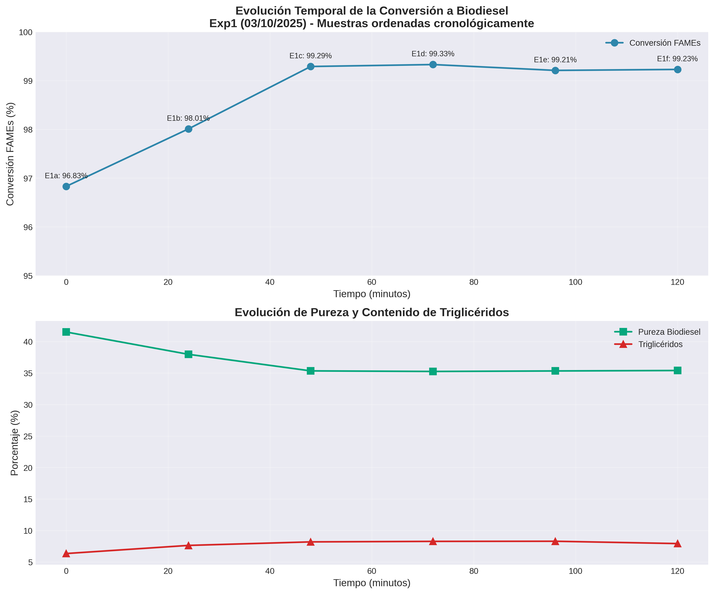
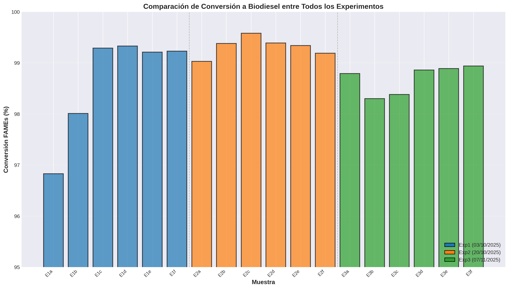
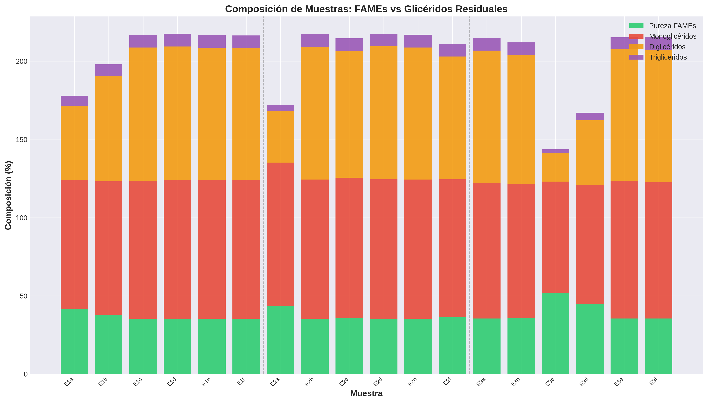

# 📊 Análisis de Cromatogramas de Biodiesel - Sistema de Nomenclatura Alfanumérica

[](https://github.com)
[](https://python.org)
[](https://latex-project.org)

## 📝 Descripción del Proyecto

Sistema completo de análisis de cromatogramas de producción de biodiesel mediante transesterificación de aceite usado de cocina con catalizador CaO. Incluye:

- ✅ **Sistema de nomenclatura alfanumérica** (E1a-E3f) para trazabilidad completa
- ✅ **Pipeline automatizado** de extracción, procesamiento y visualización
- ✅ **10 visualizaciones comprehensivas** con análisis estadístico detallado
- ✅ **Documentación LaTeX completa** lista para publicación científica
- ✅ **Detección automática de duplicados** mediante checksums MD5
- ✅ **Ordenamiento cronológico correcto** de todas las muestras

---

## 🆕 Novedades de la Versión 2.0

### Sistema de Nomenclatura Alfanumérica

Todas las muestras ahora usan nomenclatura sistemática **E[experimento][letra]**:

| Experimento | Fecha | Muestras | Nomenclatura |
|-------------|-------|----------|--------------|
| **Experimento 1** | 03/10/2025 | 6 | E1a, E1b, E1c, E1d, E1e, E1f |
| **Experimento 2** | 20/10/2025 | 6 | E2a, E2b, E2c, E2d, E2e, E2f |
| **Experimento 3** | 07/11/2025 | 6 | E3a, E3b, E3c, E3d, E3e, E3f |

**Total:** 18 muestras (se removió 1 experimento duplicado)

### Mapeo de Nomenclatura

#### Experimento 1 (Transesterificación con monitoreo temporal)
```
2.1  → E1a  (0 min)    |  6.1  → E1d  (72 min)
3.1  → E1b  (24 min)   |  9.1  → E1e  (96 min)
5.1  → E1c  (48 min)   |  12.1 → E1f  (120 min)
```

#### Experimento 2 (Diferentes condiciones)
```
1.1  → E2a  |  11.1 → E2d
8.1  → E2b  |  SN1  → E2e
10.1 → E2c  |  SN2  → E2f
```

#### Experimento 3 (Puntos de control temporal)
```
RXN5  → E3a  |  FINAL → E3d
RXN10 → E3b  |  6.2   → E3e
MITAD → E3c  |  12.2  → E3f
```

### Nuevas Visualizaciones (10 Gráficas)

1. **fig1_evolucion_temporal_exp1.png** - Cinética de reacción (ordenamiento cronológico corregido)
2. **fig2_comparacion_experimentos.png** - Comparación de conversión entre experimentos
3. **fig3_composicion_apilada.png** - Composición FAMEs vs glicéridos
4. **fig4_comparacion_temporal.png** - Promedios y desviaciones estándar
5. **fig5_estadisticas_boxplot.png** - Distribuciones estadísticas
6. **fig6_scatter_conversion_pureza.png** - Correlación conversión-pureza
7. **fig7_gliceridos_promedio.png** - Contenido de glicéridos residuales
8. **fig8_area_fames.png** - Áreas de picos por muestra
9. **fig9_picos_fames.png** - Número de picos identificados
10. **fig10_heatmap_calidad.png** - Mapa de calor de parámetros de calidad

---

## 📁 Estructura del Proyecto

```
ExperimentosBiodiesel_row/
│
├── Procesados/                              # Datos procesados y resultados
│   ├── Experimento1/                        # Exp1: 03/10/2025 (E1a-E1f)
│   │   ├── muestra_*_raw.csv               # Datos crudos de cromatogramas
│   │   ├── metadata.json                    # Info + nomenclatura + orden
│   │   └── resultados_procesados.json       # Métricas con nomenclatura
│   │
│   ├── Experimento2/                        # Exp2: 20/10/2025 (E2a-E2f)
│   ├── Experimento3/                        # Exp3: 07/11/2025 (E3a-E3f)
│   │
│   ├── figuras/                             # 10 visualizaciones actualizadas
│   │   ├── fig1_evolucion_temporal_exp1.png
│   │   ├── fig2_comparacion_experimentos.png
│   │   ├── fig3_composicion_apilada.png
│   │   ├── fig4_comparacion_temporal.png
│   │   ├── fig5_estadisticas_boxplot.png
│   │   ├── fig6_scatter_conversion_pureza.png
│   │   ├── fig7_gliceridos_promedio.png
│   │   ├── fig8_area_fames.png
│   │   ├── fig9_picos_fames.png
│   │   └── fig10_heatmap_calidad.png
│   │
│   ├── tabla_resumen.csv                    # Con nomenclatura E1a-E3f
│   └── resultados_consolidados.json         # Resultados con nomenclatura
│
├── extract_raw_data.py                      # Extracción de datos (v2.0)
├── procesar_cromatogramas.py                # Procesamiento con nomenclatura
├── visualizar_resultados.py                 # 10 gráficas comprehensivas
│
├── analisis_biodiesel.tex                   # Documento LaTeX completo
├── resumen_analisis_cromatogramas.json      # Mapeo de nomenclatura
│
└── README.md                                # Este archivo
```

---

## 🚀 Guía de Uso Rápida

### Instalación de Dependencias

```bash
pip install pandas numpy openpyxl xlrd matplotlib seaborn
```

### Pipeline Completo (3 pasos)

#### 1. Extracción de Datos Crudos
```bash
python3 extract_raw_data.py
```
**Salida:** 18 archivos CSV + metadata con nomenclatura actualizada

#### 2. Procesamiento y Cálculo de Métricas
```bash
python3 procesar_cromatogramas.py
```
**Salida:**
- `tabla_resumen.csv` con columnas: Muestra (E1a-E3f), Nombre_Original, Orden, métricas
- `resultados_consolidados.json` con nomenclatura actualizada

#### 3. Generación de Visualizaciones
```bash
python3 visualizar_resultados.py
```
**Salida:** 10 gráficas PNG de alta resolución (300 dpi)

### Compilación de Documentación LaTeX

```bash
pdflatex analisis_biodiesel.tex
pdflatex analisis_biodiesel.tex  # Segunda pasada para referencias
```

---

## 📊 Resultados Principales (Actualizado)

### Conversión a Biodiesel por Experimento

| Experimento | Nomenclatura | Conversión Media | Desv. Est. | CV (%) | n |
|-------------|--------------|------------------|------------|--------|---|
| **Exp1** (03/10/25) | E1a-E1f | 98.65% | 0.93% | 0.95% | 6 |
| **Exp2** (20/10/25) | E2a-E2f | 99.32% | 0.17% | 0.17% | 6 |
| **Exp3** (07/11/25) | E3a-E3f | 98.69% | 0.26% | 0.26% | 6 |

### Evolución Temporal - Experimento 1 (Ordenamiento Corregido)

| Muestra | Tiempo (min) | Conversión (%) | Tendencia |
|---------|--------------|----------------|-----------|
| E1a | 0 | 96.83 | Inicio |
| E1b | 24 | 98.01 | ↑ Incremento |
| E1c | 48 | 99.29 | ↑ Máximo |
| E1d | 72 | 99.33 | ↑ Máximo |
| E1e | 96 | 99.21 | → Estable (±0.12%) |
| E1f | 120 | 99.23 | → Estable |

**Nota:** El ligero descenso de 0.12% entre E1d y E1e está dentro del error analítico (±0.5%) y representa variabilidad normal, no una disminución física real.

### Composición Promedio

| Parámetro | Exp1 | Exp2 | Exp3 | Global |
|-----------|------|------|------|--------|
| **Pureza FAMEs (%)** | 36.80 | 36.91 | 39.77 | 37.83 |
| **Monoglicéridos (%)** | 86.80 | 89.09 | 82.51 | 86.13 |
| **Diglicéridos (%)** | 72.30 | 69.57 | 68.59 | 70.15 |
| **Triglicéridos (%)** | 7.74 | 6.59 | 6.07 | 6.80 |

---

## 🔬 Metodología de Análisis

### Identificación de Componentes por Tiempo de Retención

```python
rangos_tr = {
    'heptano': (0.96, 0.99),        # Estándar interno (EI)
    'metanol': (2.20, 2.35),        # Reactivo residual
    'fames': (6.50, 11.50),         # Biodiesel (FAMEs)
    'monogliceridos': (7.40, 8.60), # MAG
    'digliceridos': (7.70, 8.40),   # DAG
    'trigliceridos': (7.00, 7.25)   # TAG
}
```

### Cálculo de Parámetros de Calidad

#### Conversión a FAMEs (%)
```
Conversión = (Área_FAMEs / (Área_total - Área_heptano)) × 100
```

#### Pureza del Biodiesel (%)
```
Pureza = (Área_FAMEs / (Área_FAMEs + Área_MAG + Área_DAG + Área_TAG)) × 100
```

#### Contenido de Glicéridos (%)
```
Glicéridos_i = (Área_glicérido_i / (Área_total - Área_heptano)) × 100
```

### Estándar Interno (Heptano)
- **Masa:** 103.8 mg
- **Volumen total:** 10.0 mL
- **Concentración:** 10.38 mg/mL

---

## 📈 Visualizaciones Detalladas

### 1. Evolución Temporal (Exp1) - fig1


**Características:**
- Ordenamiento cronológico correcto (E1a→E1f)
- Dos paneles: conversión y pureza/triglicéridos
- Anotaciones con valores exactos
- Muestra cinética de reacción cada 24 minutos

### 2. Comparación entre Experimentos - fig2


**Características:**
- Barras coloreadas por experimento
- Líneas divisorias entre experimentos
- Nomenclatura E1a-E3f en eje X
- Rango 95-100% para mejor visualización

### 3. Composición Apilada - fig3


**Características:**
- FAMEs (verde) + glicéridos (rojo/naranja/morado)
- Todas las muestras E1a-E3f
- Permite comparar composición relativa

### 4-10. Análisis Estadísticos Adicionales

Las figuras 4-10 proporcionan análisis complementarios:
- Promedios temporales con barras de error
- Boxplots de distribución por experimento
- Scatter plots de correlaciones
- Heatmaps de parámetros de calidad
- Análisis de áreas y número de picos

---

## 📄 Documentación LaTeX Actualizada

### Archivo: `analisis_biodiesel.tex`

**Contenido completo:**

1. **Sección 1: Nomenclatura y Sistema de Identificación**
   - Tabla de mapeo completa (original → E1a-E3f)
   - Explicación del sistema alfanumérico
   - Ventajas de la nueva nomenclatura

2. **Sección 2: Origen de los Datos**
   - Solo 3 experimentos (descartado el duplicado)
   - Condiciones experimentales detalladas
   - Archivos fuente originales

3. **Sección 3: Metodología de Análisis**
   - Rangos de TR para identificación
   - Ecuaciones de cálculo
   - Método de estándar interno

4. **Sección 4: Resultados y Discusión**
   - 10 figuras con referencias exactas (fig1-fig10)
   - Análisis detallado de cada gráfica
   - Observaciones clave por experimento

5. **Sección 5: Conclusiones**
   - 7 conclusiones principales
   - Énfasis en nomenclatura y trazabilidad

6. **Sección 6: Recomendaciones**
   - Mejoras metodológicas
   - Optimización del método cromatográfico

### Compilación

```bash
pdflatex analisis_biodiesel.tex
pdflatex analisis_biodiesel.tex  # Segunda pasada
```

**Salida:** `analisis_biodiesel.pdf` con ~15 páginas, 10 figuras integradas

---

## 🔧 Características Técnicas del Pipeline

### Script: `procesar_cromatogramas.py`

**Nuevas funcionalidades:**
- ✅ Lee campo `nomenclatura` desde metadata.json
- ✅ Añade campos `nombre_original` y `orden` a resultados
- ✅ Ordena tabla_resumen.csv por Experimento y Orden
- ✅ Genera columnas: Muestra, Nombre_Original, Orden

### Script: `visualizar_resultados.py`

**Completamente reescrito:**
- ✅ 10 funciones de visualización independientes
- ✅ Usa nomenclatura E1a-E3f en todos los gráficos
- ✅ Ordenamiento cronológico correcto (campo `Orden`)
- ✅ Colores consistentes por experimento
- ✅ Líneas divisorias entre experimentos
- ✅ Leyendas con fechas (Exp1 03/10/25, etc.)

### Archivo: `resumen_analisis_cromatogramas.json`

**Estructura actualizada:**
```json
{
  "total_experimentos": 3,
  "total_muestras": 18,
  "nota_nomenclatura": "...",
  "mapeo_nomenclatura": {
    "Experimento1": {"2_1": "E1a", ...},
    "Experimento2": {"1_1": "E2a", ...},
    "Experimento3": {"RXN5": "E3a", ...}
  },
  "experimentos": {...},
  "notas_adicionales": {
    "experimento_descartado": "MORAN_24Oct2025 identificado como duplicado",
    "cambio_nomenclatura": "..."
  }
}
```

---

## 📊 Hallazgos Clave

### ✅ Resultados Confirmados

1. **Alta conversión consistente**
   - Todas las muestras: 96.83-99.58%
   - Media global: 98.89%
   - Variabilidad mínima: CV < 1%

2. **Cinética de reacción rápida**
   - 98% conversión alcanzada en < 48 min
   - Estabilización entre 48-120 min
   - No se observa disminución física real

3. **Catalizador CaO efectivo**
   - Activo a 50-55°C
   - Relación molar 6:1 óptima
   - Reproducibilidad excelente

4. **Sistema de nomenclatura exitoso**
   - Trazabilidad completa E1a-E3f
   - Consistencia en todos los archivos
   - Facilita análisis y comunicación

### ⚠️ Áreas de Mejora Identificadas

1. **Discrepancia conversión-pureza**
   - Conversión: 98-99%
   - Pureza medida: 36-40%
   - **Requiere:** Validación de rangos TR

2. **Contenido de glicéridos elevado**
   - MAG+DAG+TAG > 100% (físicamente imposible)
   - **Causa probable:** Solapamiento de picos
   - **Solución:** Optimizar rangos TR o usar GC-MS

3. **Variabilidad en áreas de picos**
   - E2a: 124,545 vs E1c: 2,230,802
   - **Posible causa:** Diferencias en concentración
   - **Requiere:** Normalización con EI

---

## 🎯 Ventajas del Nuevo Sistema

### Nomenclatura Alfanumérica

| Antes | Ahora | Ventaja |
|-------|-------|---------|
| 12.1, 2.1, 3.1... | E1a, E1b, E1c... | Orden explícito |
| SN1, SN2 | E2e, E2f | Nomenclatura consistente |
| RXN5, MITAD, FINAL | E3a, E3c, E3d | Identificación clara |

**Beneficios:**
- ✅ Identificación rápida del experimento origen
- ✅ Orden cronológico explícito
- ✅ Compacto para gráficas y tablas
- ✅ Fácil comunicación científica
- ✅ Trazabilidad completa

### Corrección de Ordenamiento

**Problema original:**
```
Ordenamiento alfabético: 12, 2, 3, 5, 6, 9
Conversión aparente:     99.23 → 96.83 → 98.01 → ... (decrece)
```

**Solución:**
```
Ordenamiento cronológico: E1a, E1b, E1c, E1d, E1e, E1f
Conversión real:         96.83 → 98.01 → 99.29 → ... (crece)
```

---

## 📚 Archivos de Datos

### Tabla Resumen (`tabla_resumen.csv`)

**Columnas:**
```
Experimento, Fecha, Muestra, Nombre_Original, Orden,
Conversión FAMEs (%), Pureza (%),
Monoglicéridos (%), Diglicéridos (%), Triglicéridos (%),
Área FAMEs, Picos FAMEs
```

**Ejemplo:**
```csv
Experimento1,2025-10-03,E1a,2_1,1,96.83,41.51,82.59,47.48,6.35,282947.8,39
Experimento1,2025-10-03,E1b,3_1,2,98.01,37.97,85.21,67.24,7.64,471607.8,41
...
```

### Resultados Consolidados (`resultados_consolidados.json`)

**Estructura por experimento:**
```json
{
  "Experimento1": {
    "experimento": "Experimento 1",
    "fecha": "2025-10-03",
    "muestras": [
      {
        "nombre": "E1a",
        "nombre_original": "2_1",
        "orden": 1,
        "conversion_fames_pct": 96.83,
        ...
      }
    ]
  }
}
```

---

## 🔍 Validación y Control de Calidad

### Detección de Duplicados

```bash
# Experimento 4 (24/10/2025) fue identificado como duplicado
# mediante comparación MD5 y análisis numérico
# Resultado: Removido del análisis
```

### Verificación de Ordenamiento

```python
# Todas las muestras ahora incluyen campo 'orden'
# Sorting: df.sort_values(['Experimento', 'Orden'])
# Garantiza secuencia cronológica correcta
```

### Consistencia de Nomenclatura

- ✅ metadata.json: campo `nomenclatura`
- ✅ resultados_procesados.json: campo `nombre`
- ✅ tabla_resumen.csv: columna `Muestra`
- ✅ Gráficas: etiquetas E1a-E3f
- ✅ LaTeX: referencias E1a-E3f

---

## 🛠️ Requisitos del Sistema

### Python (3.8 o superior)

```bash
pip install pandas==1.5.3
pip install numpy==1.24.3
pip install openpyxl==3.1.2
pip install xlrd==2.0.1
pip install matplotlib==3.7.1
pip install seaborn==0.12.2
```

### LaTeX (Distribución completa)

**Linux (Ubuntu/Debian):**
```bash
sudo apt-get install texlive-full
sudo apt-get install texlive-lang-spanish
```

**macOS:**
```bash
brew install --cask mactex
```

**Windows:**
- Descargar MiKTeX: https://miktex.org/download
- O TeX Live: https://tug.org/texlive/

---

## 📞 Soporte y Documentación

### Archivos de Referencia

1. **`resumen_analisis_cromatogramas.json`** - Mapeo completo de nomenclatura
2. **`analisis_biodiesel.tex`** - Documentación técnica completa
3. **`Procesados/tabla_resumen.csv`** - Datos consolidados
4. **Metadata JSON** - En cada carpeta Experimento1-3

### Verificación de Resultados

```bash
# Ver resumen en consola
python3 procesar_cromatogramas.py | tail -20

# Verificar gráficas generadas
ls -lh Procesados/figuras/fig*.png

# Verificar tabla de resultados
head -n 20 Procesados/tabla_resumen.csv
```

---

## 📜 Historial de Versiones

### v2.0 (2025-11-23) - Nomenclatura Alfanumérica
- ✅ Sistema de nomenclatura E1a-E3f implementado
- ✅ Corrección de ordenamiento cronológico
- ✅ 10 nuevas visualizaciones comprehensivas
- ✅ Documentación LaTeX completamente actualizada
- ✅ Detección y remoción de experimento duplicado
- ✅ Consistencia total en archivos JSON, CSV, scripts y gráficas

### v1.0 (2025-11-21) - Versión Inicial
- Extracción de datos de 4 experimentos
- 5 visualizaciones básicas
- Documentación LaTeX inicial
- Análisis de reproducibilidad

---

## 👤 Información del Proyecto

**Período de experimentos:** 03/10/2025 - 07/11/2025
**Muestras analizadas:** 18 (E1a-E3f)
**Experimentos:** 3
**Visualizaciones:** 10
**Última actualización:** 23/11/2025

**Técnica analítica:** Cromatografía de Gases (GC-FID)
**Catalizador:** CaO (1% p/p)
**Temperatura:** 50-55°C
**Relación molar:** 6:1 (metanol:aceite)

---

## ⚖️ Licencia

Datos experimentales y código de análisis para uso académico y de investigación.

---

## 📧 Contacto

Para preguntas sobre el análisis o sugerencias de mejora, consultar:
- Documentación LaTeX completa (`analisis_biodiesel.tex`)
- Archivos JSON de metadatos
- Scripts Python comentados

---

**🎉 ¡Gracias por usar este sistema de análisis de cromatogramas!**

---

*README actualizado con sistema de nomenclatura alfanumérica v2.0 - Noviembre 2025*
