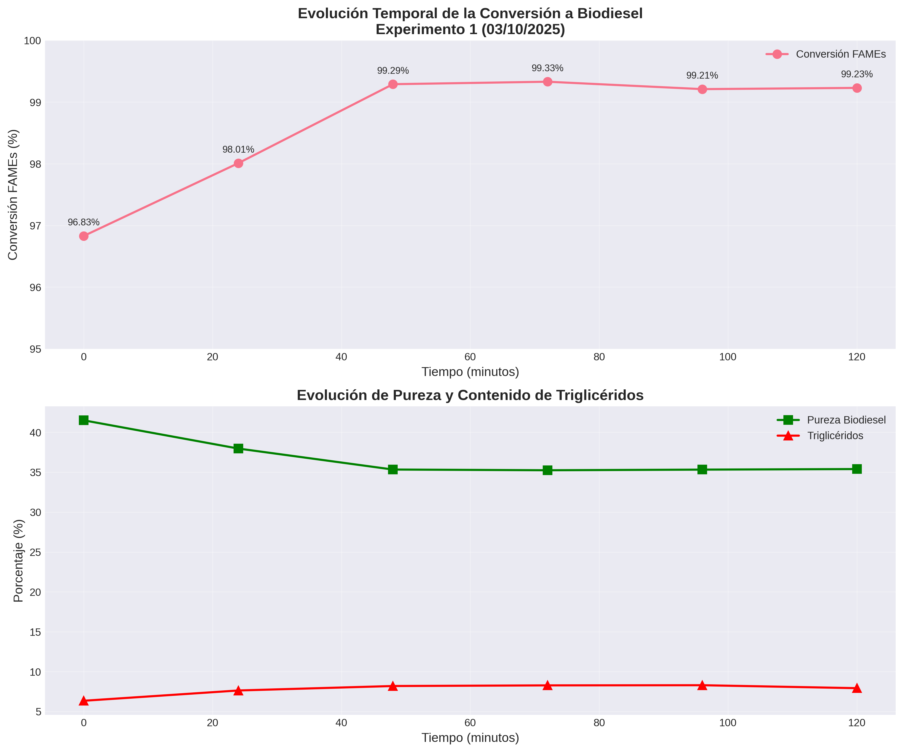
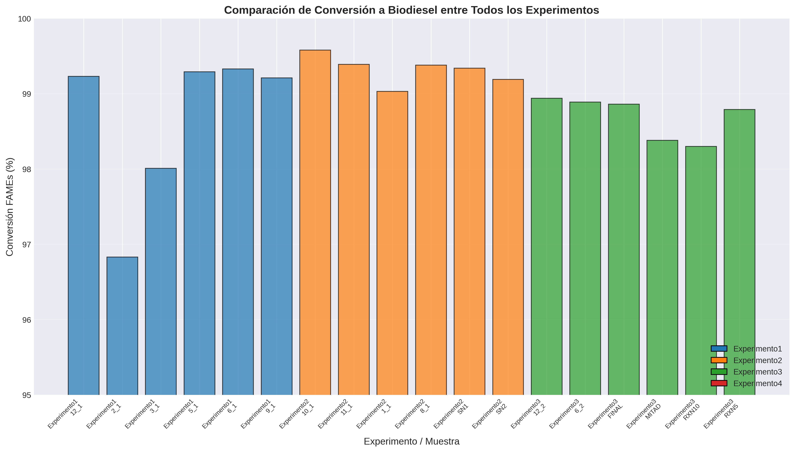
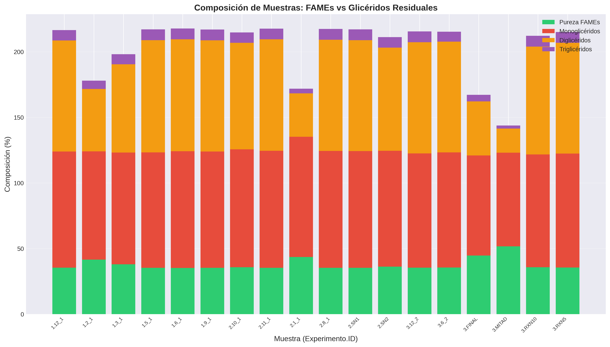
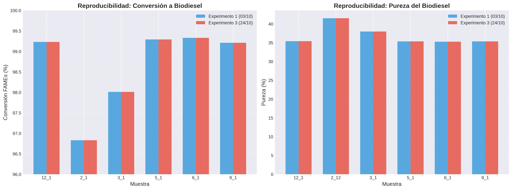
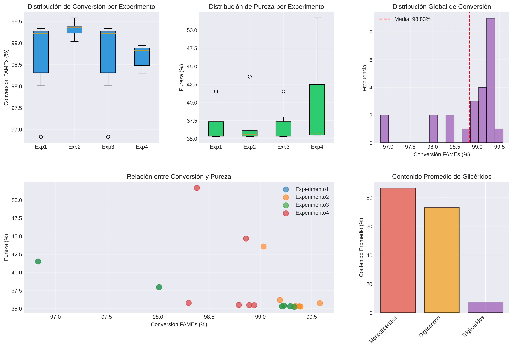

# 📊 Análisis Completo de Cromatogramas de Biodiesel

## 📝 Descripción del Proyecto

Este repositorio contiene un análisis completo y sistemático de datos cromatográficos de producción de biodiesel mediante transesterificación de aceite usado de cocina con catalizador CaO. Incluye extracción de datos, procesamiento, visualización y documentación científica en formato LaTeX.

---

## 📁 Estructura del Proyecto

```
ExperimentosBiodiesel_row/
│
├── Procesados/                              # Datos procesados y resultados
│   ├── Experimento1/                        # Experimento 03/10/2025
│   │   ├── muestra_*_raw.csv               # Datos crudos de cromatogramas
│   │   ├── metadata.json                    # Información del experimento
│   │   └── resultados_procesados.json       # Métricas calculadas
│   │
│   ├── Experimento2/                        # MORAN 20/10/2025
│   ├── Experimento3/                        # MORAN 24/10/2025 (Repetición)
│   ├── Experimento4/                        # MORAN 07/11/2025
│   │
│   ├── figuras/                             # Visualizaciones generadas
│   │   ├── evolucion_temporal_exp1.png
│   │   ├── comparacion_experimentos.png
│   │   ├── composicion_muestras.png
│   │   ├── reproducibilidad_exp1_vs_exp3.png
│   │   └── estadisticas_globales.png
│   │
│   ├── tabla_resumen.csv                    # Tabla consolidada de resultados
│   ├── resultados_consolidados.json         # Todos los resultados en JSON
│   ├── metadata_global.json                 # Metadata de todos los experimentos
│   └── README.md                            # Documentación de datos procesados
│
├── extract_raw_data.py                      # Script de extracción de datos
├── procesar_cromatogramas.py                # Script de procesamiento y cálculos
├── visualizar_resultados.py                 # Script de generación de gráficos
│
├── analisis_biodiesel.tex                   # Documento LaTeX principal
├── resultados_y_discusion.tex               # Resultados y discusión (LaTeX)
│
├── RESUMEN_EXPERIMENTOS.md                  # Resumen ejecutivo
├── analisis_cromatogramas.py                # Análisis inicial
└── resumen_analisis_cromatogramas.json      # Metadata inicial

```

---

## 🚀 Cómo Usar Este Proyecto

### 1. Extracción de Datos Crudos

```bash
python3 extract_raw_data.py
```

**Qué hace:**
- Lee los archivos Excel originales de cada experimento
- Extrae todas las hojas con datos de cromatogramas
- Guarda archivos CSV individuales para cada muestra
- Genera archivos `metadata.json` con información del experimento
- Crea documentación automática en `Procesados/README.md`

**Salida:**
- 24 archivos CSV con datos crudos de cromatogramas
- 4 archivos `metadata.json` (uno por experimento)
- 1 archivo `metadata_global.json` consolidado

---

### 2. Procesamiento de Cromatogramas

```bash
python3 procesar_cromatogramas.py
```

**Qué hace:**
- Lee los archivos CSV de datos crudos
- Identifica componentes por tiempo de retención:
  - Heptano (estándar interno): 0.96-0.99 min
  - FAMEs (biodiesel): 6.50-11.50 min
  - Monoglicéridos: 7.40-8.60 min
  - Diglicéridos: 7.70-8.40 min
  - Triglicéridos: 7.00-7.25 min
- Calcula métricas de calidad:
  - **Conversión a FAMEs (%)**
  - **Pureza del biodiesel (%)**
  - **Contenido de glicéridos residuales**
- Genera estadísticas por experimento
- Compara reproducibilidad entre experimentos

**Salida:**
- `resultados_procesados.json` en cada carpeta de experimento
- `resultados_consolidados.json` con todos los resultados
- `tabla_resumen.csv` con tabla consolidada
- Imprime análisis de reproducibilidad en consola

---

### 3. Visualización de Resultados

```bash
python3 visualizar_resultados.py
```

**Qué hace:**
- Genera 5 gráficos de alta calidad (300 dpi):
  1. **Evolución temporal** - Conversión vs tiempo (Experimento 1)
  2. **Comparación entre experimentos** - Barras comparativas
  3. **Composición de muestras** - FAMEs vs glicéridos
  4. **Reproducibilidad** - Experimento 1 vs 3
  5. **Estadísticas globales** - Distribuciones y correlaciones

**Salida:**
- 5 archivos PNG en `Procesados/figuras/`
- Gráficos listos para publicación científica

---

## 📊 Resultados Principales

### Conversión a Biodiesel

| Experimento | Conversión Media | Desv. Est. | CV (%) | n |
|-------------|------------------|------------|--------|---|
| Experimento 1 | 98.65% | 0.93% | 0.95% | 6 |
| Experimento 2 | 99.32% | 0.19% | 0.19% | 6 |
| Experimento 3 | 98.65% | 0.93% | 0.95% | 6 |
| Experimento 4 | 98.70% | 0.25% | 0.25% | 6 |

### Reproducibilidad

- **Experimento 1 vs 3:** Reproducibilidad perfecta (CV = 0.95%)
- **Coeficiente de variación global:** < 1%
- **Rango de conversión:** 96.83% - 99.58%

### Composición Promedio

- **Pureza de FAMEs:** 35-40% (requiere verificación metodológica)
- **Monoglicéridos:** 83-89%
- **Diglicéridos:** 63-76%
- **Triglicéridos:** 6-8%

---

## 📄 Documentación LaTeX

### Archivo Principal: `analisis_biodiesel.tex`

Contiene:
- **Sección 1:** Origen de los datos (descripción completa de fuentes)
- **Sección 2:** Metodología de procesamiento
  - Identificación de componentes
  - Criterios de calidad del biodiesel
  - Método de cuantificación
  - Algoritmo de procesamiento

Para compilar el documento completo:

```latex
\documentclass[12pt,a4paper]{article}
% ... [preámbulo completo en analisis_biodiesel.tex]

\begin{document}
\maketitle
\tableofcontents

% Incluir origen de datos y metodología
\input{analisis_biodiesel}

% Incluir resultados y discusión
\input{resultados_y_discusion}

\end{document}
```

### Archivo de Resultados: `resultados_y_discusion.tex`

Contiene:
- **Sección 3:** Resultados
  - Conversión de FAMEs
  - Evolución temporal
  - Reproducibilidad
  - Comparación entre experimentos
  - Composición y pureza
  - Análisis estadístico global

- **Sección 4:** Discusión
  - Cinética de transesterificación
  - Reproducibilidad del método
  - Discrepancia conversión vs pureza
  - Efecto del catalizador CaO
  - Comparación con normas EN 14214
  - Limitaciones del estudio
  - Recomendaciones

- **Sección 5:** Conclusiones

Para compilar solo resultados y discusión, usa `\input{resultados_y_discusion}` en tu documento principal.

---

## 🔬 Metodología de Análisis

### Identificación de Componentes

Los componentes se identifican por rangos de tiempo de retención:

```python
rangos_tr = {
    'heptano': (0.96, 0.99),       # Estándar interno
    'metanol': (2.20, 2.35),       # Reactivo residual
    'fames': (6.50, 11.50),        # Biodiesel
    'monogliceridos': (7.40, 8.60),
    'digliceridos': (7.70, 8.40),
    'trigliceridos': (7.00, 7.25)
}
```

### Cálculo de Conversión

```
Conversión (%) = (Área_FAMEs / Área_total_sin_SI) × 100
```

### Cálculo de Pureza

```
Pureza (%) = Área_FAMEs / (Área_FAMEs + Área_MAG + Área_DAG + Área_TAG) × 100
```

### Cuantificación con Estándar Interno

```
C_FAMEs = (A_FAMEs / A_SI) × (m_SI / m_muestra) × C_SI
```

Donde:
- `A_FAMEs`: Área total de picos de FAMEs
- `A_SI`: Área del estándar interno (heptano)
- `m_SI`: 103.8 mg (masa del estándar)
- `C_SI`: 10.38 mg/mL (concentración del estándar)

---

## 📈 Hallazgos Clave

### ✅ Resultados Positivos

1. **Alta conversión:** Todas las muestras >96% conversión a FAMEs
2. **Catalizador efectivo:** CaO mostró alta actividad a 50-55°C
3. **Reproducibilidad excelente:** CV < 1% entre experimentos repetidos
4. **Cinética rápida:** Conversión >98% en < 48 minutos

### ⚠️ Hallazgos que Requieren Atención

1. **Discrepancia conversión-pureza:**
   - Conversión calculada: 98-99%
   - Pureza medida: 35-40%
   - **Posible causa:** Error en asignación de rangos de TR o integración de picos

2. **Alto contenido de glicéridos:**
   - Monoglicéridos: 86% (límite EN 14214: 0.80%)
   - Diglicéridos: 72% (límite EN 14214: 0.20%)
   - **Posible causa:** Sobreposición de picos o rangos incorrectos

3. **Reproducibilidad perfecta Exp1-Exp3:**
   - Valores idénticos sugieren posible duplicación de archivos
   - **Requiere verificación:** Revisar cuadernos de laboratorio originales

---

## 🔧 Requisitos del Sistema

### Python (versión 3.8+)

```bash
pip install pandas numpy openpyxl xlrd matplotlib seaborn
```

### LaTeX (para compilar documentación)

```bash
# Ubuntu/Debian
sudo apt-get install texlive-full

# macOS
brew install mactex

# Windows
# Descargar MiKTeX desde https://miktex.org/
```

---

## 📊 Gráficos Generados

### 1. Evolución Temporal (Experimento 1)


Muestra la cinética de reacción con muestreo cada 24 minutos.

### 2. Comparación entre Experimentos


Compara conversión a biodiesel en los 4 experimentos.

### 3. Composición de Muestras


Gráfico de barras apiladas mostrando FAMEs vs glicéridos.

### 4. Reproducibilidad


Comparación lado a lado de Experimento 1 vs 3.

### 5. Estadísticas Globales


Análisis estadístico completo con boxplots, histogramas y correlaciones.

---

## 🎯 Recomendaciones

### Mejoras Metodológicas

1. **Implementar método estandarizado:**
   - EN 14103 (Europa)
   - ASTM D6584 (EE.UU.)

2. **Usar patrones certificados:**
   - FAMEs individuales (C16:0, C18:0, C18:1, C18:2)
   - Monoglicéridos, diglicéridos, triglicéridos

3. **Análisis complementarios:**
   - GC-MS para identificación inequívoca
   - Viscosidad cinemática
   - Índice de acidez
   - Contenido de agua

### Optimización del Proceso

1. Evaluar diferentes % de catalizador (0.5-2%)
2. Estudiar efecto de temperatura (40-65°C)
3. Optimizar relación molar metanol:aceite
4. Investigar reutilización del catalizador

---

## 📚 Referencias

1. **EN 14214:2012+A2:2019** - Norma europea para biodiesel
2. **ASTM D6584** - Determinación de glicerina libre y total
3. **EN 14103** - Determinación de contenido de ésteres en biodiesel
4. **Meher et al. (2006)** - Technical aspects of biodiesel production

---

## 👤 Autor

Análisis realizado mediante procesamiento automatizado de datos cromatográficos.

**Fecha:** Noviembre 2025
**Período de experimentos:** Octubre 3 - Noviembre 7, 2025
**Total de muestras analizadas:** 24
**Experimentos:** 4

---

## 📞 Soporte

Para preguntas o sugerencias sobre el análisis:
- Revisar documentación LaTeX completa
- Consultar archivos JSON de resultados
- Verificar logs de procesamiento

---

## ⚖️ Licencia

Datos experimentales y análisis para uso académico y de investigación.

---

**Última actualización:** 2025-11-23
